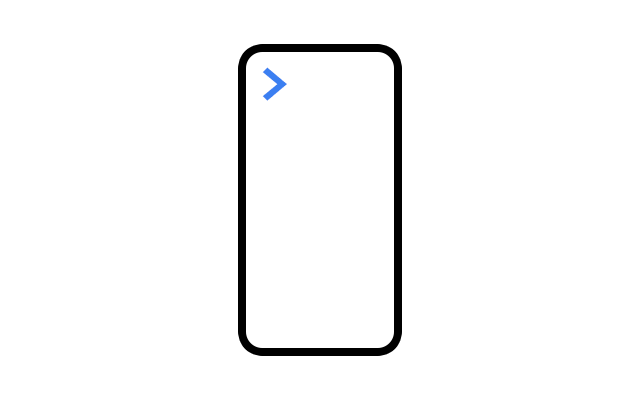

# Showlog.js



**Show `console.log` messages on screen.**

[**Demo & documentation**](https://www.achrafkassioui.com/showlog/)

## Setup

Include the JavaScript file in HTML:

```
<script type="text/javascript" src="showlog.js"></script>
``` 
Showlog will start automatically.

## Usage

Use `console.log` as usual and the message will get displayed on screen.

## Options

Stop logging messages on screen with the stop method:

```
showlog.stop();
```

Start logging messages on screen with the start method:

```
showlog.start();
```

Display messages on screen only with the log method:

```
showlog.log('Hi');
```

A boolean attached to showlog tells whether Showlog is running or not:

```
showlog.running // true or false
```

## Why Showlog

I needed to debug JavaScript code on mobile. I had the following requirements:

- **Basic logging:** display simple messages to allow for log and hunt debugging. Automatic object formatting is not included.
- **Minimal setup:** on-screen logging should start by simply dropping a JavaScript file into HTML. No initialization code should be required.
- **Minimal UI:** messages should use as little screen real estate as possible. On-screen messages should not take pointer events or interfere with the user input.
- **No harm:** the native behavior of console.log should not be altered. Specifically, the browser’s console object formatting should not be modified in any way.

## Links
- [Screenlog.js](https://github.com/chinchang/screenlog.js/), Kushagra Gour, 2015.

Screenlog.js is the closest in spirit to what I was looking for. However, the on-screen panel is bigger than what I need and it takes user input. Moreover, because screenlog.js does some work on the message passed to console.log in order to format objects, the browser’s native console formatting is altered.

- [mobileConsole](http://www.hnldesign.nl/work/code/mobileconsole-javascript-console-for-mobile-devices/), Klaas Leussink, 2016.

mobileConsole spawns an entire custom console on screen. Impressive but overkill for my needs.

## License

Showlog.js is published under the [GNU General Public License](https://www.gnu.org/licenses/gpl-3.0.en.html).
